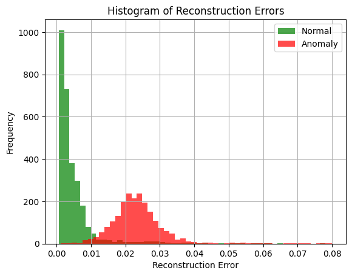
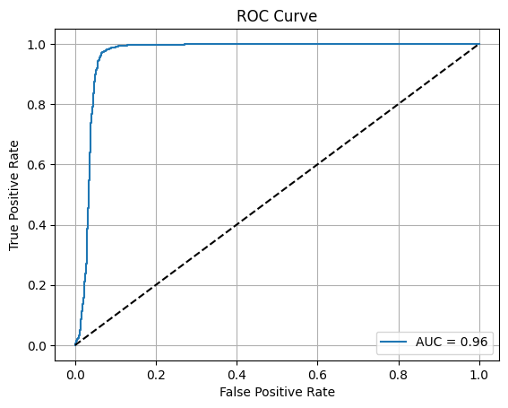
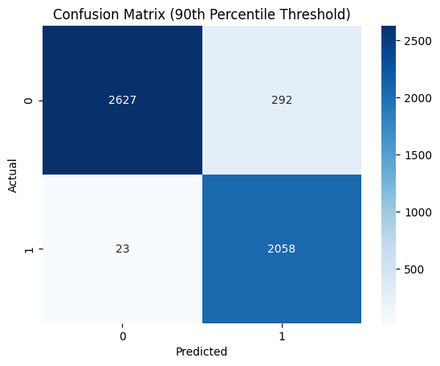
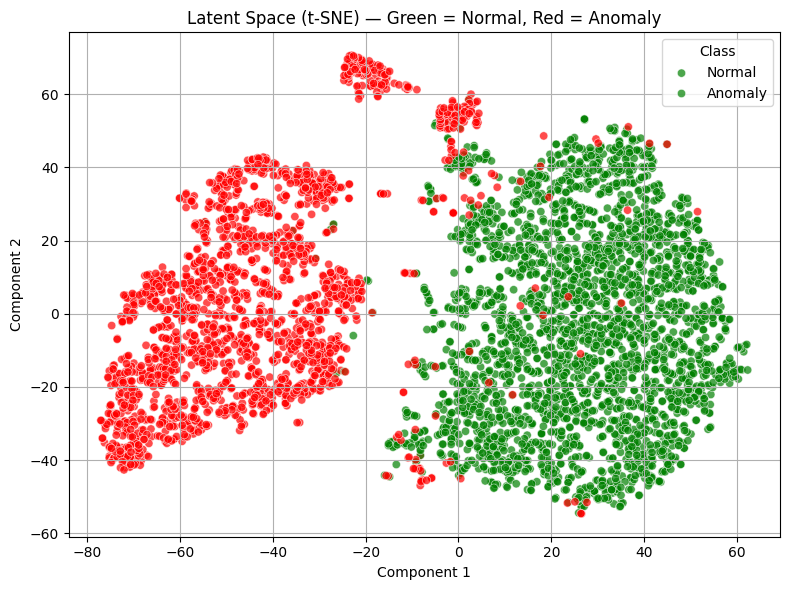

# 🫀 ECG Anomaly Detection using Variational Autoencoder (VAE)

<p>
  
  
  
  
  
  
  
</p>

---

## 🚀 Building a Deep Learning System for ECG Anomaly Detection

This project presents an **unsupervised deep learning system** for detecting anomalies in ECG (electrocardiogram) signals using a **Variational Autoencoder (VAE)**.

Unlike traditional supervised classification approaches, this system learns the underlying structure of **normal heart signals** and identifies anomalies based on deviations in reconstruction.

This makes the solution highly applicable to real-world healthcare scenarios where **labeled anomaly data is scarce or unavailable**.

---

## 🎯 Why This Project Matters

Healthcare systems require scalable and automated solutions for monitoring heart activity.

Key challenges:
- Limited labeled anomaly data  
- High variability in ECG signals  
- Need for continuous real-time monitoring  

This project demonstrates how deep learning can:
- Learn normal cardiac behavior  
- Detect abnormal patterns automatically  
- Support early diagnosis and intervention  

---

## 📊 Project Snapshot

- **Dataset:** ECG5000  
- **Task:** Unsupervised Anomaly Detection  
- **Model:** Variational Autoencoder (VAE)  
- **Approach:** Reconstruction Error-Based Detection  
- **Evaluation Metrics:** ROC-AUC, Confusion Matrix, Reconstruction Error  
- **AUC Score:** 0.96  

---

## 🏗️ System Architecture

```
ECG Signal Data
      ↓
Data Preprocessing & Normalization
      ↓
Variational Autoencoder (VAE)
      ↓
Signal Reconstruction
      ↓
Reconstruction Error Calculation
      ↓
Threshold-Based Classification
      ↓
Anomaly Detection
```

---

## ⚙️ Approach

### Variational Autoencoder (VAE)

- Encoder → compresses ECG signals into latent space  
- Latent Space → captures distribution of normal signals  
- Decoder → reconstructs input signals  

### Core Idea

- Train only on normal ECG signals  
- Model learns normal patterns  
- Anomalies produce higher reconstruction error  
- Threshold used for classification  

---

## 🧪 Training Strategy

- Training performed on normal samples only  
- Loss Function:
  - Reconstruction Loss (MSE)  
  - KL Divergence  
- Optimized using backpropagation  

---

## 📊 Results & Evaluation

### 🔹 Model Performance
- **AUC Score: 0.96**
- Strong separation between normal and anomalous signals  
- Low false negatives (critical for healthcare)

### 📈 Reconstruction Error Distribution


**Interpretation:**  
The reconstruction error distribution shows a clear separation between normal and anomalous signals. Normal ECG signals exhibit low reconstruction error, while anomalous signals produce significantly higher errors. This confirms that the model has effectively learned normal patterns and can detect deviations reliably.

### 📉 ROC Curve


**Interpretation:**  
The ROC curve demonstrates strong classification performance, with an AUC score of 0.96. This indicates that the model can effectively distinguish between normal and anomalous signals across different thresholds.

### 📊 Confusion Matrix


**Interpretation:**  
The confusion matrix shows high true positives and true negatives with relatively low false negatives. This is critical in healthcare applications, where missing anomalies can lead to serious consequences.

### 🔍 Latent Space Visualization (t-SNE)


**Interpretation:**  
The t-SNE visualization shows clear clustering between normal and anomalous signals in latent space, indicating that the model has learned meaningful feature representations.

### Overall Result Summary
The model demonstrates strong anomaly detection capability, with clear separation between normal and anomalous signals, high AUC score, and reliable classification performance across multiple evaluation metrics.

---

## 📊 Analysis & Insights

- Reconstruction error effectively separates normal and anomalous signals  
- Model generalizes well without labeled anomaly data  
- Latent space captures meaningful ECG patterns  
- Low false negatives indicate strong reliability in detecting anomalies, which is critical in healthcare applications

---

## 💼 Real-World Impact

- Early detection of heart abnormalities  
- Integration with wearable health monitoring devices  
- Automated hospital monitoring systems  
- Scalable healthcare AI solutions  

---

## ⚠️ Limitations

- Performance depends on threshold selection  
- Dataset may not represent all cardiac conditions  
- Requires tuning for real-world deployment  

---

## 🔮 Future Improvements

- LSTM / Transformer-based anomaly detection  
- Real-time ECG monitoring systems  
- Deployment as API or cloud service  
- Integration with IoT healthcare devices  

---

## Repository structure
```text
ecg-anomaly-detection-vae/
│
├── README.md
├── ecg-anomaly-detection-vae.ipynb
├── ecg-anomaly-detection-report.pdf
│
├── images/
│ ├── reconstruction_error.png
│ ├── roc_curve.png
│ ├── confusion_matrix.png
│ └── tsne_plot.png
│
└── data/
    └── ECG5000.zip
```

---

## ▶️ How to Run

```bash
pip install -r requirements.txt
jupyter notebook ecg-anomaly-detection-vae.ipynb
```

---

## 📂 Dataset

- **Dataset:** ECG5000  
- Contains labeled ECG heartbeat signals representing normal and abnormal patterns  
- Converted into binary classification:
  - Normal  
  - Anomaly  

---

## ✅ Conclusion

This project demonstrates how Variational Autoencoders can be used for effective anomaly detection in ECG signals without requiring labeled anomaly data during training.

The model successfully learns normal patterns and identifies deviations using reconstruction error, achieving strong performance with an AUC score of 0.96.

This approach highlights the potential of unsupervised deep learning models for real-world healthcare monitoring systems.

---

## 🎯 Project Highlights

✔ Deep Learning for Healthcare  
✔ Unsupervised Anomaly Detection  
✔ End-to-End Pipeline  
✔ Real-world applicability  